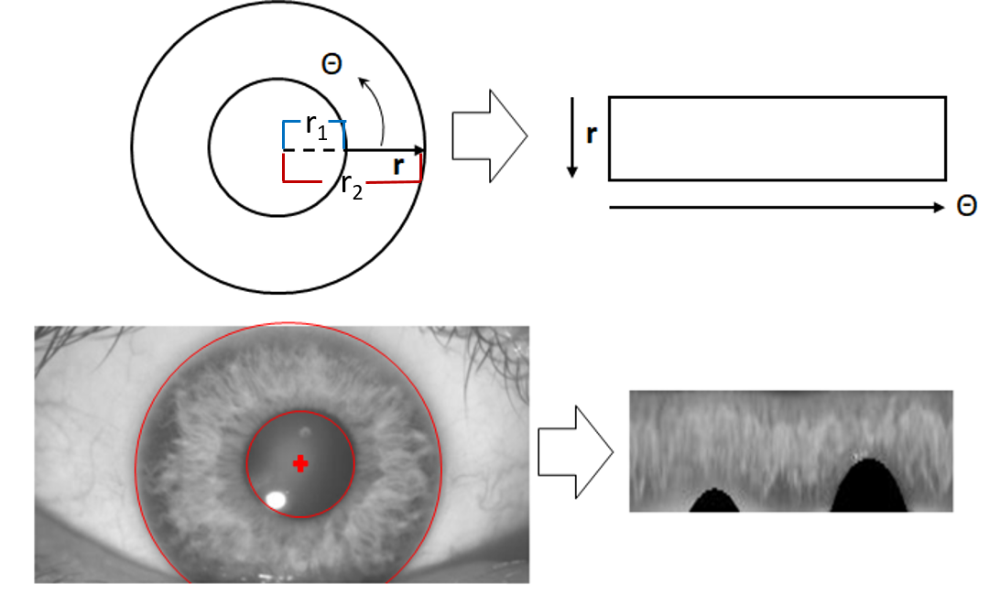
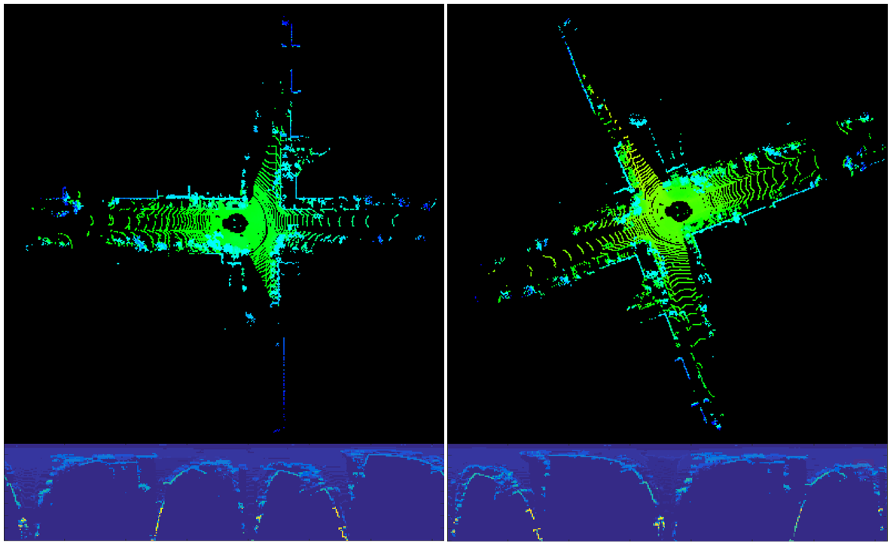

# LiDAR Iris for Loop-Closure Detection

**This repository accompanies our IROS 2020 paper [_LiDAR Iris for Loop-Closure Detection_](./iros2020.pdf).** In this paper, a global descriptor for a LiDAR point cloud, called LiDAR Iris, is proposed for fast and accurate loop-closure detection. A binary signature image can be obtained for each point cloud after several LoG-Gabor filtering and thresholding operations on the LiDAR-Iris image representation. Given two point clouds, their similarities can be calculated as the Hamming distance of two corresponding binary signature images extracted from the two point clouds, respectively. Our LiDAR-Iris method can achieve a pose-invariant loop-closure detection at a descriptor level with the Fourier transform of the LiDAR-Iris representation if assuming a 3D (x,y,yaw) pose space, although our method can generally be applied to a 6D pose space by re-aligning point clouds with an additional IMU sensor. Experimental results on five road-scene sequences demonstrate its excellent performance in loop-closure detection.
|||
|--|--|
| | |
|||
## Publication

Ying Wang, [Zezhou Sun](https://github.com/SunZezhou), Cheng-Zhong Xu, Sanjay Sarma, Jian Yang, and [Hui Kong](https://sites.google.com/view/huikonglab/home), **LiDAR Iris for Loop-Closure Detection**, _IEEE International Conference on Intelligent Robotics and Systems (IROS) 2020 (**oral presentation**)_. [[PDF]](./iros2020.pdf) [[CODE]](https://github.com/BigMoWangying/LiDAR-Iris)


## Usage
#### 1. Requirement
```
1. cmake
2. PCL
3. OpenCV
```

#### 2. Build
```
cd ${YOUR_PROJECT_DIR}
mdkir build
cd build
cmake ..
make
```

#### 3. Run
```
./demo ../data/64line_1.pcd ../data/64line_2.pcd
```

